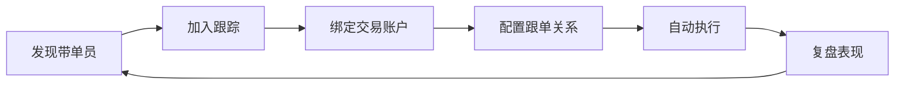
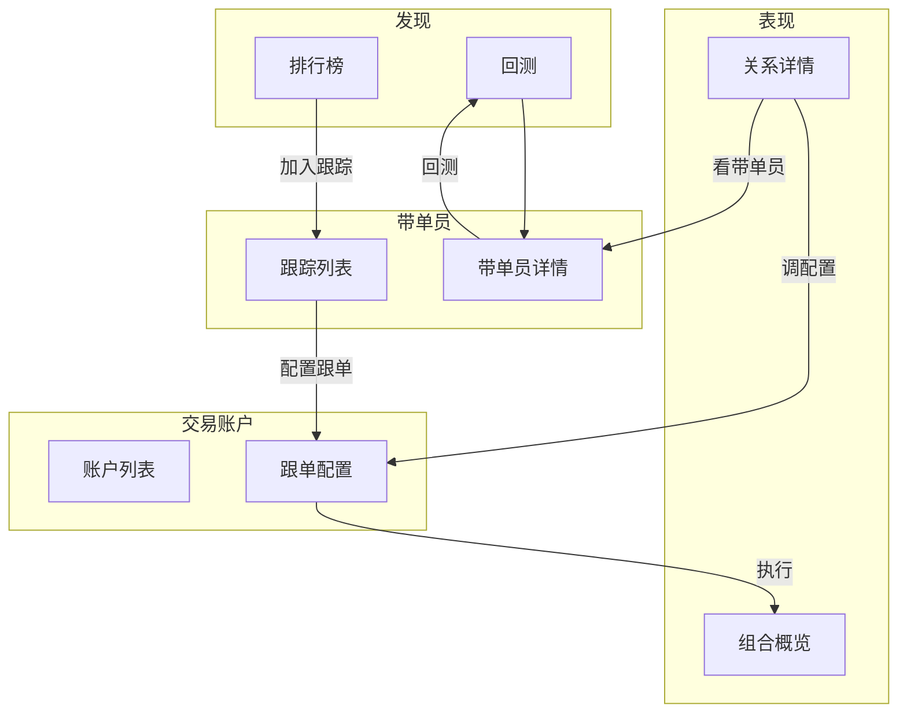

# PRD — TradeMirror / 跟单镜像

## 1. 产品概述

TradeMirror（跟单镜像）是一个统一的交易员监控与跟单执行系统，合并了两个遗留项目 — **traderSpy**（交易员仓位轮询与变更检测）和 **FollowTraderManager**（交易员跟单执行与风控）— 到一个基于 TanStack Start 的全栈应用中，使用 PostgreSQL 持久化。

### 1.1 目标用户

| 角色                | 主要诉求                                                |
| ------------------- | ------------------------------------------------------- |
| **跟单操作者**      | 发现优质带单员、配置跟单、在模拟/实盘账户执行、复盘表现 |
| **交易员 / 分析师** | 跨交易所监控带单员信号、评估策略、对比回测              |
| **管理员**          | 用户管理、系统健康、日志审计、全局交易员池维护          |

### 1.2 支持的交易所

OKX、Bitget、Binance Futures、Bybit

### 1.3 核心用户旅程



| 步骤 | 用户问题                 | 对应页面                      |
| ---- | ------------------------ | ----------------------------- |
| 发现 | 跟谁？值不值得跟？       | Discover、Backtest            |
| 跟踪 | 我跟了谁？信号状态如何？ | **带单员**（原 Strategies）   |
| 执行 | 在哪抄？怎么抄？         | **交易账户**                  |
| 复盘 | 抄得怎样？要不要调？     | **表现**（原 Strategy Board） |

### 1.4 术语表（产品层 vs 技术层）

产品面向用户统一使用左侧术语；代码与数据库可保留 legacy 命名，通过 i18n 与路由屏蔽。

| 产品术语（中文） | 产品术语（英文） | 技术/DB 实体                             | 说明                               |
| ---------------- | ---------------- | ---------------------------------------- | ---------------------------------- |
| 带单员           | Lead Trader      | `trader`                                 | 被监控的交易所公开带单员，只读持仓 |
| 交易账户         | Trading Account  | `teacher`                                | 用户绑定的 API 账户，负责下单      |
| 跟单关系         | Copy Target      | `traceTraderList` 项 + `followRelations` | 账户 × 带单员，含比例/止损         |
| 内部模拟         | Internal Paper   | `executionMode: dry-run`                 | 不调用交易所 API                   |
| 交易所模拟       | Exchange Demo    | `executionMode: demo`                    | 交易所官方模拟盘 API               |
| 实盘             | Live             | `executionMode: live`                    | 真实市场下单                       |

---

## 2. 核心模块

### 2.1 发现（Discover）

- **排行榜爬取** — OKX、Bitget、Binance 等维度：收益率、PnL、AUM、粉丝、回撤、胜率
- **收藏** — 用户级收藏列表，与排行榜合并展示
- **深度分析缓存** — 带单员详情、历史持仓等 deep cache
- **回测入口** — 跳转 `/app/backtest/$platform/$traderId`，支持 fixed/compound、30d/90d/all 窗口
- **加入跟踪** — 从发现页将带单员加入用户工作区（目标：打通到带单员页）

### 2.2 带单员监控（Trader Monitoring）

- **仓位接入** — HTTP（`POST /api/trading/ingest`）或遗留 WebSocket 桥接（端口 8011）
- **实时刷新** — 平台适配器按需轮询（`POST /api/trading/refresh`）
- **定时刷新** — 优先级调度：`live` 1s / `active` 15s / `watch` 2min / `cold` 30min
- **仓位变更检测** — diff 前次与当前快照，检测开/平/变更
- **交易员元数据** — 昵称、头像、余额、月均持仓价值、三月最大回撤等
- **历史持久化** — `historyPositions` 作为回测与分析输入

### 2.3 跟单执行（Follow Execution）

- **执行模式**
  - `dry-run` — 内部模拟，系统内生成 synthetic fill
  - `demo` — 交易所官方模拟盘（OKX/Bitget sandbox、Binance/Bybit demo trading）
  - `live` — 实盘
- **下单模式** — `ratio`（按比例）或 `fixed`（固定金额）
- **风控** — `accountMaxRiskRate`、`safeMarginRate`、`limitRiskRatio`、按关系的 `stopLossUsdt` / `stopLossPositionValueRate`
- **增量执行** — 加仓追加下单，减仓部分平仓；Binance 为 amount-class，其余为 order-class
- **跟单映射** — 本地订单 ↔ 带单员订单，支持重映射与清除
- **权益/持仓历史** — 分钟/小时/天权益快照；开仓/平仓事件含盈亏与拒绝原因

### 2.4 交易账户（Trading Accounts）

> UI 路由 `/app/accounts`；技术实体仍为 `teacher`。

- **绑定向导** — 平台 → API 凭证 → 执行模式（默认交易所模拟）
- **模拟盘连接测试** — 绑定前 `$probeTeacherAccount` 验证 API
- **账户列表** — 卡片网格：权益、跟单数、持仓数、执行模式 Badge
- **账户详情** — Tab：概览 / 跟单配置 / 持仓 / 设置
  - 概览：权益曲线、活跃跟单、最近事件
  - 跟单配置：带单员列表、比例/止损 Sheet 编辑、高级订单映射
  - 持仓：账户真实持仓 + 跟单映射持仓 + 平仓历史
  - 设置：风控参数、执行模式切换、删除账户
- **Deep Link** — `/app/accounts/$accountId?tab=follow&addTrader=xxx` 从策略/带单员页直达配置

### 2.5 带单员工作区（Lead Traders — 原策略工作区）

> **当前路由** `/app/strategies`（导航名「跟单配置」）  
> **目标路由** `/app/traders`（导航名「带单员」）

#### 2.5.1 产品定位

**带单员工作台** — 管理信号源（跟谁），不负责账户 API 与下单参数。

用户在此回答：

1. 我跟了哪些带单员？
2. 他们现在在干什么（持仓 / 最近变动）？
3. 是否继续跟踪？去哪个账户执行？

#### 2.5.2 当前实现（As-Is）问题

| 问题             | 说明                                                                         |
| ---------------- | ---------------------------------------------------------------------------- |
| 职责过载         | 同时承担：添加带单员、运行时状态、工作区列表、全局交易员池、内联设置与持仓表 |
| 与 Accounts 重复 | 跟单执行配置已迁至账户详情，本页仅剩跳转                                     |
| 与 Discover 重复 | 顶部手动 AddTraderForm，Discover 已是更好入口                                |
| 暴露内部概念     | 「共享交易员池」「Trader spy WebSocket」属运维视角                           |
| 信息密度失衡     | 每张巨型卡片含设置表单 + 10 列持仓表，难以扫读                               |

#### 2.5.3 目标设计（To-Be）

**列表页 `/app/traders`**

```
┌─────────────────────────────────────────────────────────┐
│ 带单员                                    [从发现页添加]   │
│ 跟踪 N 个 · M 个活跃信号 · K 个开仓                      │
├─────────────────────────────────────────────────────────┤
│ [全部][跟随中][观察中][已停用]   🔍 搜索    排序 ▾        │
├─────────────────────────────────────────────────────────┤
│ 轻量卡片网格（名称/平台/状态/持仓摘要/关联账户/CTA）       │
└─────────────────────────────────────────────────────────┘
```

每张卡片仅保留扫读信息：

- 名称 + 平台 + 状态 Badge
- 权益 / 持仓数 / 未实现盈亏
- 最近更新时间（staleness 提示）
- 已关联账户名（0 个则「未配置跟单」）
- CTA：`查看详情` / `配置跟单`

**详情页 `/app/traders/$traderId`（新增）**

| Tab  | 内容                                           |
| ---- | ---------------------------------------------- |
| 概览 | 余额、回撤、策略名、最近信号事件、关联账户摘要 |
| 持仓 | 当前开仓（精简表）                             |
| 设置 | 显示名、跟随/观察/停用、风险系数               |
| 回测 | 嵌入或跳转 `/app/backtest/$platform/$traderId` |

顶部动作：配置跟单、查看表现、刷新持仓。

**从本页移除 / 下沉**

| 移除项                     | 去向                        |
| -------------------------- | --------------------------- |
| WebSocket / 跟单引擎状态卡 | `/app/system`               |
| 全局交易员池               | 管理员 `/app/system` 或隐藏 |
| 内联策略设置表单           | 带单员详情 Tab              |
| 内联完整持仓表             | 带单员详情 Tab              |
| 手动 AddTraderForm         | Discover「加入跟踪」        |

**空状态引导**

1. 去「发现」浏览排行榜
2. 收藏后「加入跟踪」
3. 到「交易账户」绑定 API 并配置跟单

#### 2.5.4 保留能力（功能不丢）

- 用户级工作区（`user_trader` 关联）
- 策略状态：跟随 / 观察 / 停用
- 基础风险系数、显示名称
- 从工作区移除、全局删除（删除需二次确认）
- 实时刷新持仓（支持的平台）
- 跳转账户跟单配置（deep link）

### 2.6 跟单表现（Performance — 原策略分析看板）

> **当前路由** `/app/strategy-board`（导航名「跟单分析」）  
> **目标路由** `/app/performance`（导航名「表现」）

#### 2.6.1 产品定位

**跟单表现中心** — 复盘「交易账户 × 带单员」这条关系抄得怎么样。

区分两层分析（用户可理解，不暴露 `trader-history` / `teacher-history` 技术术语）：

| 层级               | 数据来源                        | 用户问题         |
| ------------------ | ------------------------------- | ---------------- |
| **带单员参考表现** | 交易所公开历史 / Backtest       | 他本身厉不厉害？ |
| **我的跟单表现**   | 账户 `positionHistory` 执行记录 | 我抄他抄得怎样？ |

#### 2.6.2 当前实现（As-Is）问题

| 问题             | 说明                                    |
| ---------------- | --------------------------------------- |
| 缺顶层叙事       | 直接进入 master-detail，无组合级概览    |
| 双数据源难懂     | analyticsSource 对用户无意义            |
| 与 Backtest 割裂 | 自建 SVG 图表，未复用 `backtest-charts` |
| 页面过长         | 10+ 区块纵向堆叠，无 Tab 分层           |
| 缺行动闭环       | 看完分析无法直达调配置 / 暂停跟单       |

#### 2.6.3 目标设计（To-Be）

**Layer 1 — 组合概览 `/app/performance`**

| 区块     | 内容                                               |
| -------- | -------------------------------------------------- |
| 时间窗   | 7d / 30d / 全部                                    |
| 摘要指标 | 总已实现盈亏、胜率、活跃跟单数、总未实现、最大回撤 |
| 组合曲线 | 所有跟单关系叠加权益曲线                           |
| 关系排行 | 按盈亏 / 回撤排序，点击进入详情                    |

**Layer 2 — 关系详情**

选中一条「账户 · 带单员」关系：

```
← 返回总览    Bitget主 → 带单员A    [调配置] [暂停跟单]
Tab: 我的表现 | 带单员参考 | 交易明细 | 配置
```

| Tab                  | 内容                                                                    |
| -------------------- | ----------------------------------------------------------------------- |
| **我的表现**（默认） | 累计盈亏、单笔分布、回撤；开仓时段/持仓时长分布；复用 `backtest-charts` |
| **带单员参考**       | 公开历史统计只读；CTA → 完整回测页                                      |
| **交易明细**         | 平仓记录 + 执行事件时间轴                                               |
| **配置**             | 跟单参数只读；CTA → 账户跟单 Tab                                        |

**URL 约定**

```
/app/performance
/app/performance?copy={accountId}:{traderId}
/app/performance?copy={accountId}:{traderId}&tab=trades
```

#### 2.6.4 保留的分析能力

从现有 `strategy-analytics` 保留并重组展示：

- 从持久化历史重建已平仓交易
- 胜率、已实现收益、盈亏因子、最大回撤、平均持仓时长
- 累计收益与收益率曲线
- 单笔已实现收益分布
- 开仓小时 / 星期 / 持仓时长分布
- 运行时执行历史（订单级）

### 2.7 页面协作关系



**职责边界（重构后）**

| 页面     | 管什么                            | 不管什么                    |
| -------- | --------------------------------- | --------------------------- |
| 发现     | 海选、回测、收藏                  | 执行、账户 API              |
| 带单员   | 信号源、监控状态、关联账户摘要    | API 密钥、下单参数          |
| 交易账户 | API、执行模式、跟单参数、账户持仓 | 带单员公开数据挖掘          |
| 表现     | 盈亏复盘、关系统计                | 实时配置修改（只读 + 跳转） |

### 2.8 通知系统

- **渠道** — 飞书、Telegram、Discord
- **类别** — `trader-change`、`runtime-warning`、`startup`、`bybit-attention`
- **路由** — 环境变量默认 + 运行时覆盖；`/app/system` 按类开关
- **富消息** — Bybit 浏览器回退截图附件

### 2.9 遗留消息桥接

- 遗留 WebSocket（端口 8001），中文 JSON 键
- `/app/messages` 浏览消息、链上、账户设置

### 2.10 系统监控

- 运行时健康、调度器、行情订阅图、Bybit 浏览器回退
- 通知 sink、运行时事件、API 健康（`/app/api-health`）
- 系统日志（`/app/logs`，管理员）

### 2.11 管理与认证

- Better Auth：`admin` / `user`；邮箱密码 + GitHub/Google OAuth
- `/app/users` 用户管理（管理员）

### 2.12 国际化

- zh-CN / en 双语；`useI18n()` + 路由级 `use*Text()` 辅助函数
- 产品术语随 PRD 术语表统一（带单员 / 交易账户 / 表现）

---

## 3. 路由表

### 3.1 当前路由（As-Is）

| 路由                                | 导航名   | 描述                            | 访问   |
| ----------------------------------- | -------- | ------------------------------- | ------ |
| `/`                                 | —        | 落地页                          | 公开   |
| `/login` `/signup`                  | —        | 认证                            | 游客   |
| `/app`                              | —        | 仪表盘（迁移说明向）            | 已认证 |
| `/app/discover`                     | 发现     | 排行榜、收藏、深度分析          | 已认证 |
| `/app/backtest/$platform/$traderId` | —        | 带单员回测分析                  | 已认证 |
| `/app/strategies`                   | 跟单配置 | 用户工作区 + 全局池 + 内联配置  | 已认证 |
| `/app/strategy-board`               | 跟单分析 | 跟单关系 master-detail 分析     | 已认证 |
| `/app/accounts`                     | 交易账户 | 账户列表、绑定向导              | 已认证 |
| `/app/accounts/$accountId`          | —        | 账户详情（概览/跟单/持仓/设置） | 已认证 |
| `/app/accounts/$accountId/logs`     | —        | 账户运行日志                    | 已认证 |
| `/app/messages`                     | 消息     | 遗留消息                        | 已认证 |
| `/app/system`                       | 系统     | 运行时状态、通知                | 已认证 |
| `/app/api-health`                   | 接口健康 | 交易所 API 探针                 | 已认证 |
| `/app/users`                        | 用户     | 用户管理                        | 管理员 |
| `/app/logs`                         | 日志     | 系统日志文件                    | 管理员 |
| `/api/trading/ingest`               | —        | 仓位接入                        | 内部   |
| `/api/trading/refresh`              | —        | 实时刷新                        | 内部   |
| `/api/auth/*`                       | —        | Better Auth                     | 公开   |

### 3.2 目标路由（To-Be）

| 现路由                | 目标路由                 | 目标导航名 | 变更说明                     |
| --------------------- | ------------------------ | ---------- | ---------------------------- |
| `/app/strategies`     | `/app/traders`           | 带单员     | 轻列表 + 职责收敛            |
| —                     | `/app/traders/$traderId` | —          | 新增详情页                   |
| `/app/strategy-board` | `/app/performance`       | 表现       | 组合概览 + Tab 详情          |
| `/app/teachers`       | `/app/accounts`          | 交易账户   | ✅ 已完成                    |
| `/app`                | `/app`                   | 工作台     | 由迁移说明改为真实摘要仪表盘 |

**重定向**：旧路由保留 302 至新路由至少一个版本周期。

**目标导航顺序**：发现 → 带单员 → 交易账户 → 表现 → 系统

---

## 4. 数据模型

### 4.1 交易 Schema

| 表名                              | 用途                | 产品术语 |
| --------------------------------- | ------------------- | -------- |
| `trader`                          | 全局带单员记录      | 带单员   |
| `teacher`                         | 跟单执行账户        | 交易账户 |
| `user_trader`                     | 用户 ↔ 带单员工作区 | 跟踪关系 |
| `trader_sync_state`               | 轮询优先级与锁      | —        |
| `runtime_state` / `runtime_event` | 运行时健康与审计    | —        |
| `market_candle`                   | OHLCV               | —        |
| `discover_rank_cache`             | 排行榜缓存          | —        |
| `discover_trader_deep_cache`      | 深度分析缓存        | —        |
| `user_discover_favorite`          | 发现收藏            | —        |
| `trader_backtest_run`             | 回测结果            | —        |

### 4.2 关键 JSONB 字段

| 实体      | 字段               | 含义                                 |
| --------- | ------------------ | ------------------------------------ |
| `trader`  | `positions`        | 带单员当前持仓快照                   |
| `trader`  | `historyPositions` | 带单员历史平仓（回测/参考表现）      |
| `teacher` | `traceTraderList`  | 跟单关系配置列表                     |
| `teacher` | `followRelations`  | 活跃跟单订单映射                     |
| `teacher` | `positionHistory`  | 我的跟单执行历史（表现分析主数据源） |
| `teacher` | `equityHistory`    | 账户权益曲线                         |

### 4.3 消息 / 认证 Schema

见 legacy `messages.schema` 与 Better Auth 表（`user`、`session`、`account`、`verification`）。

---

## 5. API 与服务端能力

### 5.1 HTTP 端点

- `POST /api/trading/ingest` — 快照或遗留 positionChange payload
- `POST /api/trading/refresh` — `{ traderId }` 触发实时刷新

### 5.2 主要 Server Functions（节选）

| 函数                           | 用途              |
| ------------------------------ | ----------------- |
| `$getTraders` / `$addTrader`   | 带单员工作区      |
| `$getTeachers` / `$addTeacher` | 交易账户          |
| `$probeTeacherAccount`         | 模拟盘连接测试    |
| `$refreshTeacherAccount`       | 刷新账户余额/持仓 |
| `$updateTeacherTraceTraders`   | 更新跟单关系配置  |
| `$fetchTraderRankList`         | 发现排行榜        |
| `$fetchTraderDeepAnalysis`     | 发现深度分析      |

---

## 6. 环境配置

见 `src/env/server.ts` / `.env.example`：

- 数据库、认证、各所 API 凭证
- 通知 webhook、遗留 WS 端口
- Bybit Puppeteer 回退相关

---

## 7. 技术栈

| 层级        | 技术                                               |
| ----------- | -------------------------------------------------- |
| 框架        | TanStack Start（React 19）                         |
| 路由 / 数据 | TanStack Router + Query v5 + Server Functions      |
| UI          | shadcn/ui、Tailwind、Recharts（`backtest-charts`） |
| ORM         | Drizzle + PostgreSQL                               |
| 交易所      | CCXT + 平台适配器 + Puppeteer（Bybit）             |
| 认证        | Better Auth                                        |
| i18n        | 自定义 zh-CN/en                                    |

---

## 8. 实施路线图

### 8.1 已完成

- [x] 交易账户 UI 重构（列表 + 详情 Tab + 绑定向导 + 交易所模拟盘）
- [x] 路由 `/app/teachers` → `/app/accounts`，产品术语「交易账户」
- [x] 跟单配置从 Strategies 迁至 Accounts（deep link）
- [x] Discover + Backtest + 收藏
- [x] 四家交易所 demo 执行模式

### 8.2 Phase 1 — 带单员 / 表现定位收敛（1–2 天）

**带单员页**

- [x] 移除 WebSocket / 跟单引擎状态卡、全局交易员池、内联表单与持仓表
- [x] 列表改为轻量卡片 + 筛选/搜索
- [x] 空状态与 Discover / Accounts 引导链

**表现页**

- [x] 顶部新增组合概览指标条（已实现/未实现盈亏、活跃跟单数）
- [ ] 文案统一：account × lead trader（表现详情区仍部分沿用 legacy 文案）

### 8.3 Phase 2 — 路由与详情页（3–5 天）

- [x] `/app/strategies` → `/app/traders` + `/app/traders/$traderId`
- [x] `/app/strategy-board` → `/app/performance` + `?copy=` search param
- [ ] Discover「加入跟踪」→ 带单员列表（待打通）
- [x] 旧路由重定向（`/app/strategies`、`/app/strategy-board`）
- [x] 导航/i18n：`nav.traders`、`nav.performance`

### 8.4 Phase 3 — 分析体验（5–7 天）

- [ ] Performance 接入 `backtest-charts`，替换自建 SVG
- [ ] Tab 拆分：我的表现 / 带单员参考 / 交易明细 / 配置
- [ ] 组合级权益曲线（多关系聚合）
- [ ] 三角 deep link：Performance ↔ Accounts ↔ Traders

### 8.5 Phase 4 — 工作台（可选）

- [ ] `/app` 首页改为真实工作台：活跃跟单、今日盈亏、待处理告警
- [ ] 取代当前「迁移目标」说明卡片

### 8.6 长期技术债

1. 迁移遗留 traderSpy 剩余轮询适配器
2. K 线驱动回测层增强
3. 实盘切换二次确认、审计日志
4. 通知路由数据库化
5. 技术层 `teacher` 实体重命名为 `account`（含 DB migration，低优先级）

---

## 9. 验收标准（Phase 2 完成时）

| 场景                               | 预期                                               |
| ---------------------------------- | -------------------------------------------------- |
| 新用户从 Discover 收藏并跟踪带单员 | 在带单员列表看到卡片，无全局池干扰                 |
| 配置跟单                           | 从带单员卡片一键跳转账户跟单 Tab                   |
| 查看表现                           | 表现页先看总览，再下钻单条关系                     |
| 区分两种分析                       | 「带单员参考」与「我的跟单」标签清晰，数据源不混用 |
| 术语一致                           | 全站用户可见文案无 teacher/策略工作区/共享池       |
| 旧链接                             | `/app/strategies`、`/app/strategy-board` 可重定向  |

---

## 10. 附录：遗留映射

| 遗留系统                 | 现承接                                          |
| ------------------------ | ----------------------------------------------- |
| traderSpy 监控           | `engine.ts` + 适配器 + ingest/refresh           |
| FollowTraderManager 执行 | `execution-service.ts` + `runtime.ts`           |
| Streamlit 策略看板       | `/app/strategy-board` → 目标 `/app/performance` |
| 策略列表页               | `/app/strategies` → 目标 `/app/traders`         |
| Teacher 账户管理         | `/app/accounts`                                 |
